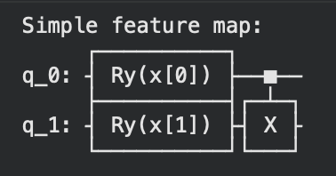
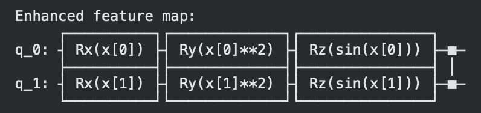
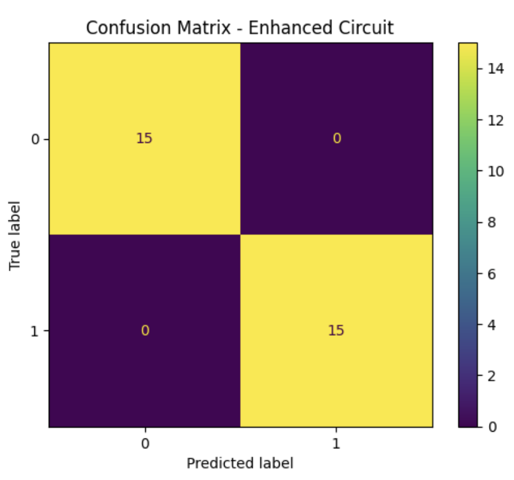

# QOSF Cohort 11 Screening Task 4: QSVM

For this task I implemented a simple and enhanced quantum circuit to do binary classification on the Iris dataset. Each circuit has two qubits, one for each feature. The simple circuit has a single rotational layer and uses a linear entanglement, while the enhanced circut uses three rotational layers and full entanglement:





Both circuits had an accuracy of 100%, but the enhanced circuit took nearly twice as long to run.

```
Output:

Execution time (Simple circuit): 26.9813 seconds
Execution time (Enhanced circuit): 42.3612 seconds

Accuracy (Simple circuit):   1.000
Accuracy (Enhanced circuit): 1.000
```

Since the simple circuit is more shallow, it runs faster and has lower noise, but it might not be well suited to more complex data. The enhanced circuit is slower and more prone to noise but would work better with more complex data. 



